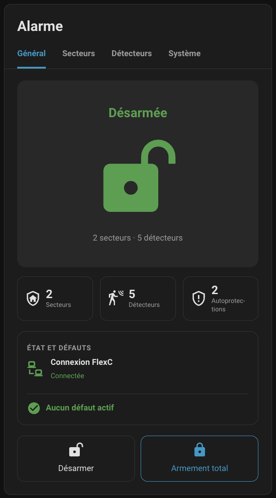
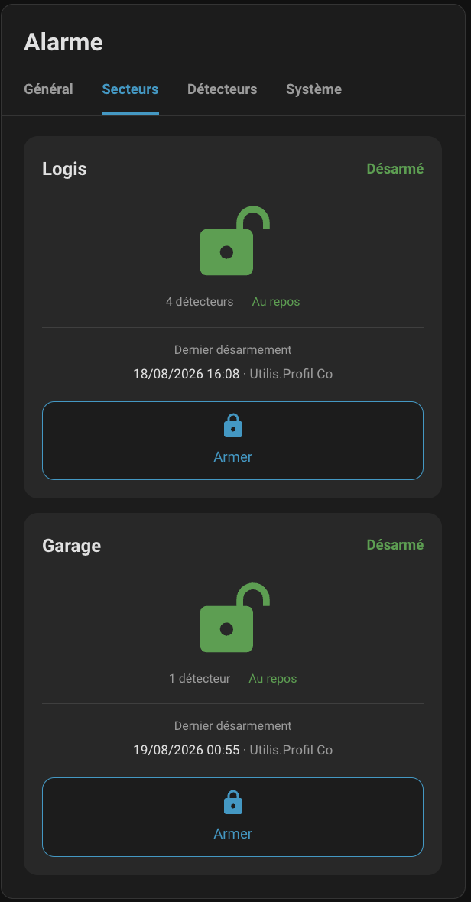
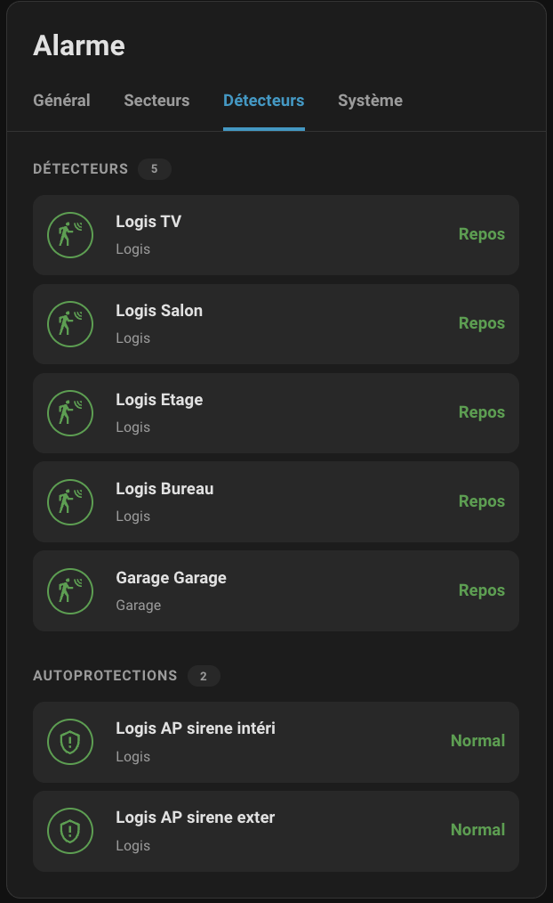
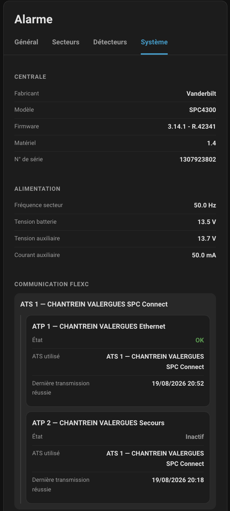
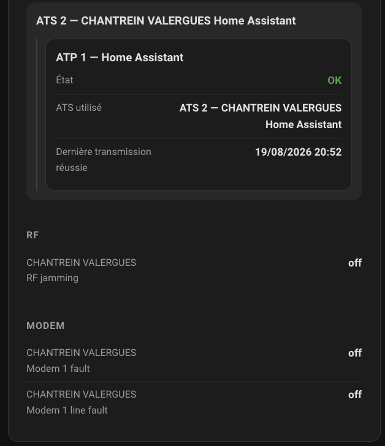

# SPC FlexC Card

> Dedicated Lovelace dashboard card for the SPC FlexC Home Assistant integration.

<p align="center">

[](https://github.com/minimicro34/ha-spc-flexc-card/releases)
[](https://github.com/minimicro34/ha-spc-flexc-card/actions/workflows/ci.yml)
[](https://github.com/minimicro34/ha-spc-flexc-card/actions/workflows/hacs.yml)
[](https://www.home-assistant.io/)
[](https://buymeacoffee.com/minimicro34)
[](LICENSE)

</p>

<p align="center">
  🔐 Alarm control • 🏠 Areas • 🚪 Detectors • 📡 FlexC • 🩺 Diagnostics
</p>

SPC FlexC Card is a custom Home Assistant dashboard card designed for the
[SPC FlexC integration](https://github.com/minimicro34/ha-spc-flexc).

It provides a dedicated interface for everyday alarm control while keeping
technical SPC and FlexC information available in a separate system view.

> [!IMPORTANT]
> This card can trigger alarm state-changing services.
> Confirmation dialogs are enabled by default.

## Screenshots

### General



### Areas



### Detectors



### System





---
## Contents
---

- [Features](#features)
  - [General](#general)
  - [Areas](#areas)
  - [Detectors](#detectors)
  - [System](#system)
- [Requirements](#requirements)
- [Installation](#installation)
  - [HACS](#hacs)
  - [Manual installation](#manual-installation)
- [Configuration](#configuration)
- [Options](#options)
- [Alarm safety](#alarm-safety)
- [Dynamic information](#dynamic-information)
- [Development](#development)
- [Contributing](#contributing)
- [Disclaimer](#disclaimer)
- [Support](#support)
- [Related project](#related-project)
- [License](#license)

## Features

SPC FlexC Card provides four dedicated views:

### General

The General view is designed for everyday use and includes:

- global alarm state;
- area, detector and tamper counters;
- FlexC connection status;
- active SPC faults;
- Engineer / Installer mode indication when active;
- global Disarm and Full Set controls.

Technical entity IDs are intentionally hidden from the normal user interface.

### Areas

The Areas view provides individual SPC area control.

For each area, the card can display:

- current arming state;
- Arm or Disarm action according to the current state;
- Part Set A when supported by the area;
- Part Set B when supported by the area;
- last Set / Unset information;
- localized date and time;
- user name, with user ID as fallback.

The SPC panel remains authoritative for arming availability and validation.

### Detectors

The Detectors view displays SPC zones and separates normal detectors from
tamper states.

The visual convention is:

- green — normal;
- orange — normal activity such as movement or opening;
- red — alarm, fault or tamper;
- grey — unavailable or unknown.

The card uses the states and attributes exposed by the SPC FlexC integration
and does not invent unavailable detector information.

### System

The System view contains technical and diagnostic information that is less
useful during normal daily operation.

Depending on what the SPC panel and integration expose, this can include:

- manufacturer;
- model;
- firmware and hardware information;
- serial number;
- panel power and battery information;
- RF and modem diagnostics;
- X-BUS devices and diagnostics;
- FlexC ATS paths;
- ATP paths associated with each ATS;
- active FlexC path;
- ATP fault state;
- last successful transmission timestamp for each ATP.

ATS and ATP information is dynamically discovered from Home Assistant.

ATP numbering displayed by the card is local to each ATS. Internal FlexC ATP
identifiers are used only to associate the corresponding entities and are not
shown as user-facing ATP numbers.

The active path reported by the ATS is used to distinguish the active ATP from
inactive fallback paths.

The selected card tab is preserved across Home Assistant rerenders and page
reloads.

## Requirements

- Home Assistant;
- the SPC FlexC custom integration;
- HACS is recommended for installation and updates.

The integration is available at:

https://github.com/minimicro34/ha-spc-flexc

## Installation

### HACS

Add this repository as a custom repository in HACS:

```text
https://github.com/minimicro34/ha-spc-flexc-card
```

Repository type:

```text
Dashboard
```

Then install **SPC FlexC Card** and reload Home Assistant if required.

### Manual installation

Copy the built file:

```text
ha-spc-flexc-card.js
```

to a location served by Home Assistant and add it as a Lovelace JavaScript
module resource.

HACS installation is recommended because it handles the dashboard resource and
updates more conveniently.

## Configuration

Minimal configuration:

```yaml
type: custom:spc-flexc-card
entity: alarm_control_panel.spc_alarm
```

Full example:

```yaml
type: custom:spc-flexc-card
entity: alarm_control_panel.spc_alarm
name: SPC FlexC
show_controls: true
confirm_actions: true
```

The card also provides a visual editor in Home Assistant.

## Options

| Option | Required | Default | Description |
| --- | --- | --- | --- |
| `entity` | Yes | — | Global SPC FlexC alarm entity |
| `name` | No | `SPC FlexC` | Card title |
| `show_controls` | No | `true` | Display alarm control actions |
| `confirm_actions` | No | `true` | Request confirmation before state-changing alarm actions |

## Alarm safety

SPC FlexC Card deliberately keeps state-changing operations conservative.

Alarm actions are sent through Home Assistant services and confirmation is
enabled by default.

The card does not attempt to bypass SPC readiness checks or force an arming
operation rejected by the panel.

Automatic retries of state-changing alarm commands must not be implemented.

## Dynamic information

The exact information displayed depends on:

- SPC panel model;
- SPC firmware;
- installed SPC hardware;
- configured ATS/ATP paths;
- X-BUS devices;
- entities and attributes exposed by the installed SPC FlexC integration
  version.

Missing information is simply not displayed.

The card does not create fictitious panel, ATS, ATP, X-BUS or diagnostic data.

## Development

Edit:

```text
src/ha-spc-flexc-card.js
```

Then build the distributable file:

```bash
npm run build
```

Run the project checks:

```bash
npm run check
git diff --check
```

The generated HACS distributable is:

```text
ha-spc-flexc-card.js
```

at the repository root.

Do not edit the generated file directly.

## Contributing

Contributions are welcome.

Please read [CONTRIBUTING.md](CONTRIBUTING.md) before submitting changes.

Contributions can include:

- bug fixes;
- visual improvements;
- support for additional SPC entities or diagnostics;
- improved mobile and desktop layouts;
- accessibility improvements;
- documentation.

For significant alarm-control behaviour changes, please open a GitHub Issue
before starting a large implementation.

> [!WARNING]
> Never publish FlexC encryption keys, Command Profile passwords, SPC user
> PINs, installer codes or other alarm credentials in Issues, Pull Requests,
> logs or screenshots.

## Disclaimer

SPC FlexC Card is an independent open-source project.

It is not affiliated with, endorsed by, or supported by Siemens, Vanderbilt,
Comelit or Home Assistant.

Alarm systems are security equipment. Always validate the behaviour of your
specific panel, SPC FlexC integration and Home Assistant installation before
relying on dashboard alarm control.

The authors and contributors cannot be held responsible for alarm activations,
failed arming operations, missed information, security incidents or other
consequences resulting from the use of this card.

## Support

If you find SPC FlexC Card useful and would like to support its development,
you can buy me a coffee.

<p align="center">
  <a href="https://buymeacoffee.com/minimicro34">
    
  </a>
</p>

Your support helps dedicate more time to improving the card, adding new
features, testing additional SPC configurations and fixing issues.

Bug reports, feature suggestions, contributions and GitHub stars are also
greatly appreciated.

Please use GitHub Issues for bug reports and feature requests.

When reporting an issue, please include whenever possible:

- SPC FlexC Card version;
- SPC FlexC integration version;
- Home Assistant version;
- browser and device type;
- a clear description of the problem;
- screenshots when relevant;
- relevant browser console errors;
- relevant Home Assistant entity states or attributes.

For display or entity-discovery problems, please also indicate which card view
is affected:

- General;
- Areas;
- Detectors;
- System.

Never include passwords, PINs, FlexC encryption keys or other alarm
credentials.

## Related project

SPC FlexC Home Assistant integration:

https://github.com/minimicro34/ha-spc-flexc

## License

This project is licensed under the MIT License.

See [LICENSE](LICENSE) for details.